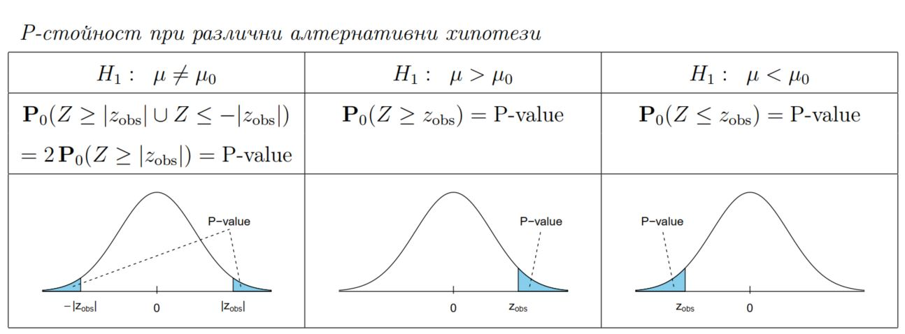

## Случайни експерименти

**Избор на случайни елементи от вектор с връщане:**
```{r}
    sample(x=1:5, size=3, replace=T)
```

**Избор на случайни елементи от вектор без връщане:**
```{r}
    sample(x=1:5, size=3, replace=F)
```

**Генериране на пермутация:**
```{r}
    x <- 1:5
    sample(x, length(x), replace=F)
```
**Намиране на честота на събитие (приблизителна вероятност):**

В отдел на фирма работят 20 човека. За Коледа те решават да си разменят
подаръци. В кутия слагат 20 листчета, на всяко от които има едно име. Всеки тегли листче
(без да го връща) и подарява на този, чието име е изтеглил. Каква е вероятността поне
един да изтегли своето име?

```{r}
sim <- function(num_people) {
    x <- sample( 1:num_people, num_people, replace=F ) # permute
    d <- x - 1:num_people # diff between personal and received number
    any(d==0) # check if for any there is no diff between the two numbers
}

prob <- function(times, num_people) {
    result <- replicate(times, sim(num_people))
    sum(result)/length(result)
}

prob(100000, 20)
```
**Условна вероятност:**

Имаме 3 карти: първата е бяла от двете страни, втората е черна от двете
страни, а третата е бяла от едната и черна от другата страна. Всяка карта е поставена в
затворена кутия. Избираме произволна кутия, отваряме я и виждаме, че горната страна
на картата в нея е бяла. Каква е вероятността другата страна на картата също да е бяла?

```{r}
sim <- function() {
    cards <- sample(c("bb", "ww", "bw"), 1)
    side <- sample(1:2, 1 )
    up <- substr(cards, start=side, stop=side)
    c(up, cards)
}

prob <- function(times) {
    result <- replicate(times, sim())
    sum(result[2,]=="ww") / sum(result[1,]=="w")
}

prob(100000)
```
## Случайни величини

### Дискретни случайни величини

**Бернулиево разпределение**

X - *брой успехи*

```{r}
successes <- 10
tries <- 20
success_probability <- 0.5
number_observations <- 10

# P(X = successes)
dbinom(successes, tries, success_probability)

# P(X <= successes)
pbinom(successes, tries, success_probability)

# generate number_observations numbers from the Binomial distribution
rbinom(number_observations, tries, success_probability)
```

**Геометрично разпределение**

X - *брой опити до успех*

```{r}
tries <- 2
success_probability <- 0.5
number_observations <- 10

# P(X = tries)
dgeom(tries - 1, success_probability)

# P(X <= tries)
pgeom(tries - 1, success_probability)

# generate number_observations numbers from the Geometric distribution
rgeom(number_observations, success_probability) + 1
```

X - *брой неуспехи преди първи успех*

```{r}
tries <- 2
success_probability <- 0.5
number_observations <- 10

# P(X = tries)
dgeom(tries, success_probability)

# P(X <= tries)
pgeom(tries, success_probability)

# generate number_observations numbers from the Geometric distribution
rgeom(number_observations, success_probability)
```

**Отрицателно биномно разпределение**

X - *брой опити преди r-ти успех включително*

```{r}
successes <- 10
tries <- 20
success_probability <- 0.5
number_observations <- 10

# P(X = tries)
dnbinom(tries - successes, successes, success_probability)

# P(X <= tries)
pnbinom(tries - successes, successes, success_probability)

# generate number_observations numbers from the Negative Binomial distribution
rnbinom(number_observations, successes, success_probability) + successes
```

X - *брой неуспехи преди r-ти успех*

```{r}
successes <- 10
failures <- 10
success_probability <- 0.5
number_observations <- 10

# P(X = failures)
dnbinom(failures, successes, success_probability)

# P(X <= tries)
pnbinom(failures, successes, success_probability)

# generate number_observations numbers from the Negative Binomial distribution
rnbinom(number_observations, successes, success_probability)
```

**Хипергеометрично резпределение**

N - *общ брой топки*

M - *брой бели топки*

X - *брой извадени бели топки (при извадени L без връщане)*

```{r}
chosen_white <- 5
white <- 10
all <- 20
tries <- 10
number_observations <- 10

# P(X = chosen_white)
dhyper(chosen_white, white, all - white, tries)

# P(X <= chosen_white)
phyper(chosen_white, white, all - white, tries)

# generate number_observations numbers from the Hypergeometric distribution
rhyper(number_observations, white, all - white, tries)
```

**Поасоново разпределение**

X - **брой случвания на събитието**

```{r}
occurences <- 1
rate <- 0.6
number_observations <- 10

# P(X = occurences)
dpois(occurences, rate)

# P(X <= occurences)
ppois(occurences, rate)

# generate number_observations numbers from the Poisson distribution
rpois(number_observations, rate)
```

### Непрекъснати случайни величини

**Равномерно разпределение**


```{r}
min <- 0
max <- 10
x <- 4
p <- 0.5
number_observations <- 5

# f(x)
dunif(x, min, max)

# P(X <= x)
punif(x, min, max)

# Q(x)
qunif(p, min, max)

# generate number_observations numbers from the Uniform distribution
runif(number_observations, min, max)
```
**Експоненциално разпределение**


В теорията на вероятностите и статистиката, експоненциалното разпределение е разпределение на **времето между събитията** в процес на точка на Поасон, т.е. процес, при който **събитията се случват непрекъснато и независимо** с постоянна средна скорост.

```{r}
rate <- 0.5
x <- 4
p <- 0.5
number_observations <- 5

# f(x)
dexp(x, rate)

# P(X <= x)
pexp(x, rate)

# Q(x)
qexp(p, rate)

# generate number_observations numbers from the Exponential distribution
rexp(number_observations, rate)
```

**Нормално разпределение**

```{r}
mean <- 5
standard_deviation <- 2
x <- 6
p <- 0.5
number_observations <- 5

# f(x)
dnorm(x, mean, standard_deviation)

# P(X <= x)
pnorm(x, mean, standard_deviation)

# Q(x)
qnorm(p, mean, standard_deviation)

# generate number_observations numbers from the Normal distribution
rnorm(number_observations, mean, standard_deviation)
```

## Данни. Таблици и графики

### Данни от тест
```{r}
exam <- read.table("../datasets/examAB.txt", header=T)
exam

variant <- exam$variant

class(variant)

table(variant)
table(variant) / length(variant)
sort(table(variant) / length(variant), decreasing=T)

barplot(table(variant))
barplot(table(variant) / length(variant))
barplot(sort(table(variant) / length(variant), decreasing=T))
pie(table(variant))

```

### Други числови данни
```{r}
wait <- c(2,3,3,5,5,2,7,10,4,3,1,7,11,10,5,6,3,8,5,12,5,3,8,5,7)

table(wait)

wait_grouped <- cut(wait, breaks=seq(0,12,2))
table(wait_grouped)
table(wait_grouped)/length(wait)

barplot(table(wait_grouped))

hist(wait)
hist(wait, probability=T)
hist(wait, breaks=seq(0, 12, 3))

# хистограма с честотен полигон
h <- hist(wait, probability=T)
lines(
    x=c(
        min(h$breaks),
        h$mids,
        max(h$breaks)
    ),
    y=c(
      0,
      h$density,
      0
    ),
    type="l",
    lwd=2,
    col="darkorange1"
)

stripchart(
    wait,
    method="stack",
    pch=20,
    cex=1.5
)

# диаграма клон с листа (stem-and-leaf plot)
# интервали: [0, 4], (4, 9], (9, 12]
stem(wait)

# увеличаване на броя подинтервали
# интервали: [0, 1] (1, 3] (3, 5], (5, 7], (7, 9], (9, 11] (11, 13]
stem(wait, scale=2)


```

## Числови характеристики на данните
```{r}
x <- airquality$Temp

# средно
mean(x)

# медиана
median(x)

# стандартно отклонение
sd(x)

# p-квантил
quantile(x, p)

# Q1
quantile(x, 0.25)
# Q3
quantile(x, 0.75)

# IQR = Q3 - Q1
IQR(x)

summary(x)

boxplot(x, horizontal=T)
```

## Многомерни данни

```{r}
library(MASS)
?survey
str(survey)

# извежда данните като таблица
# fix(survey)

summary(survey)

# equilavnt notations
survey[, 'Age']
survey$Age

# 12-та колона
survey[ ,12]

# 5-ти ред
survey[5, ]
```
**Крос-таблица**
```{r}
attach(survey)

table(Smoke, W.Hnd)

# премахване на липсващите наблюдения
table(Smoke, W.Hnd, useNA="no")
```

**Сравняване на таблици**
```{r}
# таблица с относителния дял
prop.table(table(Smoke, W.Hnd))

# таблица с редови проценти
prop.table(table(Smoke, W.Hnd), 1)

# таблица с колонни проценти
prop.table(table(Smoke, W.Hnd), 2)

barplot(
    table(Smoke, W.Hnd),
    legend=T,
    args.legend=list(
        x="topleft",
        inset=0.05
    )
)
barplot(
    table(W.Hnd, Smoke),
    beside=T,
    legend=T,
    args.legend=list(
        x="topright",
        inset=0.05
    )
)
```

**Сравняване на стойности на категорийни променливи и корелация**

Ако данните са близо до "възходяща" права линия, то корелацията им е близко до 1. Това показва, че те "растат" *заедно*.

Ако данните са близо до "низходяща" права линия, то корелацията им е близко до -1. Това показва, че те "растат" *противоположно*.

Ако корелацията им е близо до 0, то не наблюдаваме тенденции на линейна зависимост между тях.

```{r}
# кутуя с мустаци
boxplot(Pulse ~ Smoke)

# лентова диаграма
stripchart(Pulse ~ Smoke, vertical=T)

# точкова диаграма
plot(Height, Pulse)
cor(Height, Pulse, use="complete.obs")

plot(Wr.Hnd, Height)
cor(Wr.Hnd, Height, use="complete.obs")

plot(Wr.Hnd, NW.Hnd)
cor(Wr.Hnd, NW.Hnd, use="complete.obs")

# преобразуваме данните, за да получим отрицателна корелация
plot(Wr.Hnd, -1 * NW.Hnd)
cor(Wr.Hnd, -1 * NW.Hnd, use="complete.obs")
```

## Централна гранична теорема

**Централна гранична теорема**

Централната гранична теорема гласи, че разпределението на **средното на извадката е приблизително нормално**, ако размерът на извадката е достатъчно голям, дори ако разпределението на популацията не е нормално.


**Пример 1**

Времето на живот на електрическа крушка от даден тип има експоненциално
разпределение със средно 900 часа. Измерено е времето на живот на 100 случайно избрани
крушки. Каква е вероятността полученото средно време да е над 980 часа?

Използваме тази формула:


```{r}
a <- (980-900)/(900/sqrt(100))

# P(X <= 980) = pnorm(a)
# P(X > 980) = 1 - pnorm(a)
1 - pnorm(a)
```

**Пример 2**

Регистрираният багаж на пътниците в даден самолет не трябва да надвишава общо 4000 кг. Количеството регистриран багаж на произволно избран пътник е случайна
величина със средно 24 кг и стандартно отклонение 7 кг. Каква е вероятността общото количество регистриран багаж в самолет със 160 пътници да надвиши 4000 кг?

Използваме еквивалентна формула:


```{r}
a <- (4000 - 160*24)/(7*sqrt(160))

# P(X <= 4000) = pnorm(a)
# P(X > 4000) = 1 - pnorm(a)
1 - pnorm(a)
```

# Проверка на хипотези при една извадка

**z-тест за средно**

Използваме z-тест за средно, когато искаме да сравним наблюдаваната средна стойност на случайни величини с предварително зададена стойност.
Дисперсията на случайните величини е **известна**.



**Пример**

Фирма произвежда електрически крушки. Средното време на живот на една
крушка е 2000 часа със стандартно отклонение 300 часа. Предложен е нов тип крушки.
Изпробвани са 100 крушки от новия тип. Резултатите показват средно време на живот
на новите крушки 2100 часа и същото стандартно отклонение. Може ли да се твърди, че
средното време на живот на новия тип крушки е повече от 2000 часа?

```{r}
# H_0: mu = 2000
# H_1: mu > 2000
x.bar <- 2100
n <- 100
sigma <- 300
mu <- 2000

# пресмятаме наблюдаваната стойност
z.obs <- (x.bar - mu) / (sigma/sqrt(n))

# P(X <= 2000) = pnorm(z.obs)
# P(X > 2000) = 1 - pnorm(z.obs)
p.value <- 1 - pnorm(z.obs)

# p-стойността е по-малка от 0,05
# -> отхвърляме H_0 в полза на H_1]
# -> времето на живот е повече от 2000
p.value
```

**t-тест за средно**

Използваме t-тест за средно, когато искаме да сравним наблюдаваната средна стойност на случайни величини с предварително зададена стойност.
Дисперсията на случайните величини е **неизвестна**.


**Пример**

Според исторически данни, средната киселинност на дъждовете в определен
индустриален район е 5.2. За да се провери има ли изменение в тази стойност е измерена
киселинността на 12 валежа през изминалата година. Получени са следните резултати:
````{verbatim}
6.1   5.4   4.8   5.8   6.6   5.3   6.1   4.4   3.9   6.8   6.5   6.3
````
От предишни изследвания е известно, че киселинността на валежите има нормално разпределение. Имаме ли основания да твърдим, че киселинността в района се е променила в сравнение с историческите данни?

```{r}
# H_0: mu = 5.2
# H_1: mu =\= 5.2
x <- c(6.1, 5.4, 4.8, 5.8, 6.6, 5.3, 6.1, 4.4, 3.9, 6.8, 6.5, 6.3)

t.test(x, mu=5.2)

# p-стойността е по-голяма от 0.05
# -> не отхвърляме H_0
# -> средната стойност не се е променила
t.test(x, mu=5.2)$p.value
```


**z-тест за пропорция**

Използваме z-тест за пропроция, когато имаме **Бернулиеви опити** (с резултат "успех" или "неуспех"), всеки от които с вероятност за успех p. Предполагаме, че имаме **"успех" в X% от случаите**. Искаме да проверим дали предположението ни отговаря на действителността.


**Пример**

Известно е, че при 10% от колите от дадена марка се появява сериозен
дефект по време на гаранционния срок. От първите 25000 продадени коли от нов модел,
2700 се оказали с дефект. Може ли да се твърди, че вероятността в кола от новия модел да се появи дефект не е 10%?

```{r}
# H_0: p = 0.1
# H_1: p =\= 0.1
prop.test(x=2700, n=25000, p=0.1, correct=F)

# p-стойността е по-малка от 0.05
# -> отхвърляме H_0 в полза на H_1
# -> вероятността не е 10%
prop.test(x=2700, n=25000, p=0.1, correct=F)$p.value
```

## Проверка на хипотези при две извадки

**t-тест за разлика на средни**

Използваме t-тест за разлика на средни, когато имаме 2 независими извадки, чиито средни искаме да сравним.


**Пример**

Мениджър обмисля въвеждане на допълнителна 15-минутна почивка за работниците си. За да разбере дали такава почивка ще намали броя на грешките, които правят
работниците, избрал случайно 2 групи по 10 души. Първата група имала допълнителна почивка, а втората работила по обичайното работно време. Данните за броя на допуснатите
грешки от двете групи са следните:
````{verbatim}
Група 1: 8, 7, 5, 8, 10, 9, 7, 8, 4, 5
Група 2: 7, 6, 14, 12, 13, 8, 9, 6, 10, 9
````
Приемаме, че данните са приблизително нормално разпределени. Може ли да се заключи,
че работниците с допълнителна почивка правят средно по-малко грешки?

```{r}
# H_0: mu_X = mu_Y
# H_1: mu_X < mu_Y
x <- c(8, 7, 5, 8, 10, 9, 7, 8, 4, 5)
y <- c(7, 6, 14, 12, 13, 8, 9, 6, 10, 9)


t.test(x, y, alt="less")

# p-стойността е по-малка от 0.05
# -> отхвърляме H_0 в полза на H_1
# -> средното на група 1 е по-малко от това на група 2
t.test(x, y, alt="less")$p.value
```

**t-тест при зависими извадки**

t-тест, който използваме, когато имаме 2 зависими извадки (т.е. на всеки елемент от 1-вата извадка съответства елемент
от втората - двойки наблюдения), чиито средни искаме да сравним.

**Пример**

За да се изследва ефекта на диета върху нивото на холестерол в кръвта
са избрани 15 мъже на възраст между 35 и 50 години. Нивото на холестерола на всеки
участник е измерено преди започване на диетата и три месеца след прилагане на диетата.
Данните са следните:

````{verbatim}
Участник Преди След
       1   265  229
       2   240  231
       3   258  227
       4   295  240
       5   251  238
       6   245  241
       7   287  234
       8   314  256
       9   260  247
      10   279  239
      11   283  246
      12   240  218
      13   238  219
      14   225  226
      15   247  233
````
Приемаме, че нивото на холестерол е нормално разпределено. Дали тези данни дават основание да се твърди, че диетата намалява нивото на холестерол в средно?
```{r}
# H_0: mu_X = mu_Y
# H_1: mu_X > mu_Y
x <- c(265,240,258,295,251,245,287,314,260,279,283,240,238,225,247)
y <- c(229,231,227,240,238,241,234,256,247,239,246,218,219,226,233)

t.test(x, y, alt="greater", paired=T)

# p-стойността е по-малка от 0.05
# -> отхвърляме H_0 в полза на H_1
# -> средното "Преди" е по-малко от това "След"
t.test(x, y, alt="greater", paired=T)$p.value
```

**z-тест за разлика на пропорции**

Използваме z-тест за разлика на пропорции, когато имаме 2 независими извадки, показващи резултати от Бернулиеви опити (т.е. всеки един елемент от извадката да е булева стойност), и искаме да сравним пропорциите на "успех" в двете извадки.


**Пример**

В проучване участвали 220 жени и 210 мъже. Според резултатите, 71 жени
и 58 мъже отговорили, че предпочитат безкофеиново кафе. Може ли да твърдим, че процентът на жените, предпочитащи безкофеиново кафе, е различен от процентът на мъжете, предпочитащи безкофеиново кафе?

```{r}
# H_0: p_X = p_Y
# H_1: p_X =\= p_Y

# брой "успехи" във всяка от извадките
x <- c(71,58)
# съответстващ общ брой наблюдения във всяка от извадките
n <- c(220,210)

prop.test(x, n, correct=F)

# p-стойността е по-голяма от 0.05
# -> не отхвърляме H_0
# -> процентът на жените, пиещи безкофеиново кафе, не е по-голям от този на мъжете
prop.test(x, n, correct=F)$p.value
```
